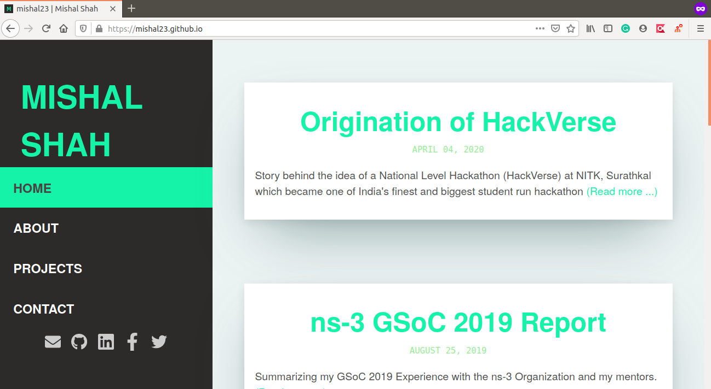

# mishal23.github.io

- Personal website in Gatsby.
- The website was initially in Jekyll, source code can be found [here](https://github.com/mishal23/jekyll-blog)



# 🚀 Steps to run

```bash
git clone https://github.com/mishal23/mishal23.github.io/
cd mishal23.github.io
npm install
gatsby develop
```
