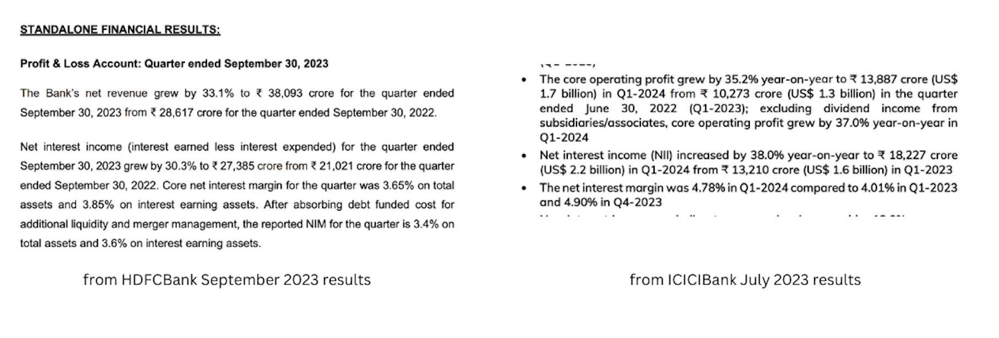

I have been interested in the stock markets since quite sometime and thus documenting some of the stuff which I've been reading and understanding to analyze companies. Every sector in the stock markets needs to be analyzed in a different way and thus starting with the bank sector. Financial institutions are very important to any economy as it is a good indication of the market conditions.

Before going into details, let's understand how a bank makes money. Although, there are a lot of ways, one of the major ways a bank makes money is borrow money from someone at a lower rate and lend it to someone else with a higher rate. Most of our metrics will be based on this.

#### How does a bank borrow money?

- Fixed deposits
- Money lying around in savings and currents account

#### How does a bank lend money?

Loans

Based on this information, let's talk about various metrics that the banks report in their finanical results and those that will help analyze the bank better.

_Disclaimer: Please do not take it any of it as a financial advise and consult your CA before making any decision._

### Net Interest Margin

Now, for a bank to make good profits, the bank should have a wider difference in the interest it earns through lending and interest it gives to whom it borrows from. The bank also has an operating expense which would eat up this margin. This comes up with our first metric: Net Interest Margin.

Net Interest Margin = (Interest income - Interest expensed) / (Net Interest earning assets)

A negative net interest margin defines the bank is borrowing more than lending which is a red flag and a greater NIM defines the bank is earning more, leading to more profits which is a green flag. This is usually reported in the press release of the results. Below is the NIM reported from the latest [HDFC Bank](https://www.bseindia.com/xml-data/corpfiling/AttachHis/704d63c1-2f25-4324-84fb-0e4afd81b0c4.pdf) and [ICICI Bank](https://www.bseindia.com/xml-data/corpfiling/AttachHis/62cd490f-29ff-4b95-9da9-957c027255dd.pdf) results.

### Non-performing assets

From all the loans that the bank issues, some get defaulted. Those turn into non-performing assets (NPA). These NPA keep accumluating over time and could grow quite big, so the banks set aside some percentage from their profits to write them off. This is called provisioning. For the first 90 days, the banks report the NPA as gross NPA (_in the hope that it could get repaid_). After 90 days, the bank adds it to the Net NPA after subtracting it with the money set aside for provisioning. Thus, Net NPA is the loans which the bank doesn't have any insurance (provision) for.

As you would guess, the lower these ratios (bad loans / total loans), the better it is for the bank. This ratio is directly present in the finanical statements. A great bank would be able to maintain the Net NPA to a considerable amount for a very long period of time and that would define the goverance in the bank. So checking these ratios for a historical time would be helpful. For eg. YES Bank during the downturn had a very bad Gross and Net NPA.

### Provision coverage ratio

Since, we talked about provisions in NPA, let's talk about it. As mentioned earlier, it is a portion of the profits which the banks keep aside for the bad loans.

Provision coverage ratio = (total value of provisions for bad loans) / (total value of non-performing assets)

A higher value of PCR means that the bank has enough money to handle the bad loans. This is reported in the results in the press release.

### CASA ratio

The banks love people who keep money in the current and savings account as they have to give a lower interest to them and can use them to lend money at much higher rates and this increases the net interest margin significantly. Thus, it is considered good for banks to have more amount of money lying in Current and Savings accounts (CASA).

CASA ratio = total money in current and savings account / total deposits

### Capital Adequacy ratio (CAR)

Since banks gets money from people who deposit, they're liable to pay the money to these depositors. But the banks are also at the risk of losing the money it has lent to the borrowers in terms of loans or investments. Thus, this ratio defines the capital the bank have over the risky assets. A higher CAR ratio meaning the bank has enough money to protect the losses against the assets as well as how safe the money of the depositors is. This ratio is also reported in the financial results directly.

### Return on assets

By now we know how the bank makes money, this ratio is calculated by dividing the total profits divided by the total assets (money lended). A higher ratio means the company is earning good amount of profits over the assets that they've in total. This is also a safety net for people depositing their money. This is also reported in the finanical results directly.

---

The above are some of the metrics that one can use to analyze the banks apart from P/E ratio, EPS among the standard ones. The list is not comphrensive and quite some other things also need to be evaluated, but the above should be a good starting point. I would also recommend hearing/reading the management commentary (atleast the transcript) which would help you analyze the bank further. The transcripts are available on the investor relations page of any company.
