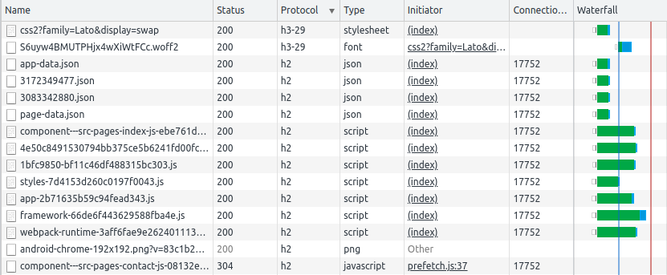
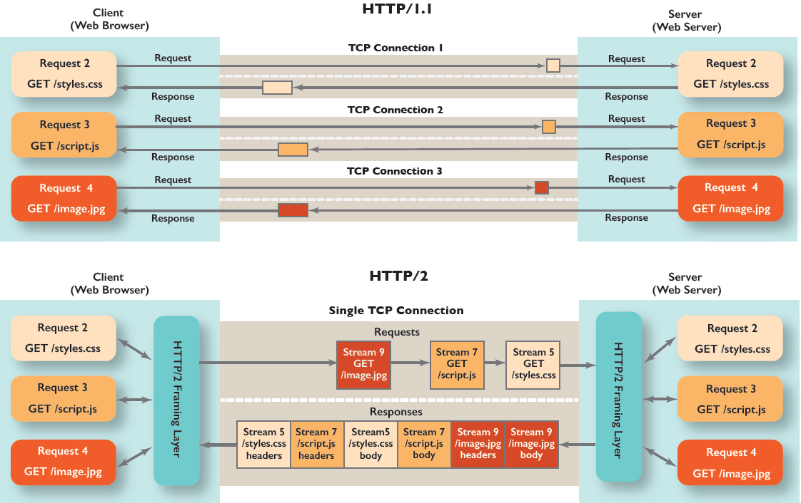

My favourite time pass is to scroll on Twitter because I come across some good tweets (in my interests) and reading some shit-posts ;)

So, one fine day I came across [this tweet](https://twitter.com/TmPreet/status/1381914359639773187). The tweet asked why Chrome opens multiple connections for HTTP/1.1 for the same website but uses the same connection for HTTP/2?

How do we find out if Chrome opens a new connection or not? Notice the image below -- the connection ID remains the same for this website, whereas for a website hosted on an HTTP/1.1 server, there are multiple connection IDs.

I got curious about this behaviour and wanted to understand more. I had previously studied the differences in persistent connections between HTTP/1.0 and HTTP/1.1 but never really explored the upgrades in HTTP/2 or HTTP/3.0. This seemed like a good opportunity, and thus decided to dive into it.

## HTTP/1.1 Pipelining

Traditionally the behaviour of HTTP requests is that for the same connection, to send the subsequent request we've to wait for the response of the first request. As you might have already guessed, this would significantly increase the load time of a website's resources. Pipelining was introduced in HTTP/1.1 through which a client could send multiple requests without waiting for the server to send the response. The server will send the response to the client in the same order as the requests received.

This does seem to solve the problem, but it failed because:

- servers ignored pipelined requests or corrupted the responses
- [head of line blocking](https://en.wikipedia.org/wiki/Head-of-line_blocking): the first request in the pipeline blocked other requests in the pipeline, thus leading to slower pages.

Hence, to optimize loading a page from the server supporting HTTP/1.1, Chrome browser opens 6 parallel connections, thus sending parallel requests and leading to faster page load. The reason why 6 connections was chosen as optimal is something I'm trying to understand, but don't have an answer yet. If you have an answer, please feel free to comment below.

## HTTP/2 Multiplexing

To address the limitations in pipelining, HTTP/2 introduced multiplexing. HTTP/2 introduced a binary framing mechanism because of which multiplexing could be achieved since it allows the client and the server to break down an HTTP message into independent frames, interleave them and reassemble at the other end. Thus, the browser can send multiple requests with the same connection without any blocking, and we see Chrome using the same connection ID for HTTP/2 requests.

The diagram below depicts the differences in browser behaviour between HTTP/1.1 and HTTP/2.

## Conclusion

As we learned above, most modern browsers allow up to six parallel connections per origin in HTTP/1.1, which effectively allows up to six parallel resource transfers, whereas because of multiplexing in HTTP/2, one single connection by the browser serves effectively for resource transfers.

## References & Further Reading:

- Image comparing HTTP/1.1 and HTTP/2 is taken from: [How is HTTP/1.1 different from HTTP/2?](https://freecontent.manning.com/mental-model-graphic-how-is-http-1-1-different-from-http-2/)
- To learn about binary framing mechanism & HTTP/2 working: [HTTP/2](https://hpbn.co/http2/)
- [HTTP/1.1 RFC2616](https://datatracker.ietf.org/doc/html/rfc2616), [HTTP/2 RFC7540](https://datatracker.ietf.org/doc/html/rfc7540)
- https://www.chromium.org/developers/design-documents/network-stack/http-pipelining
