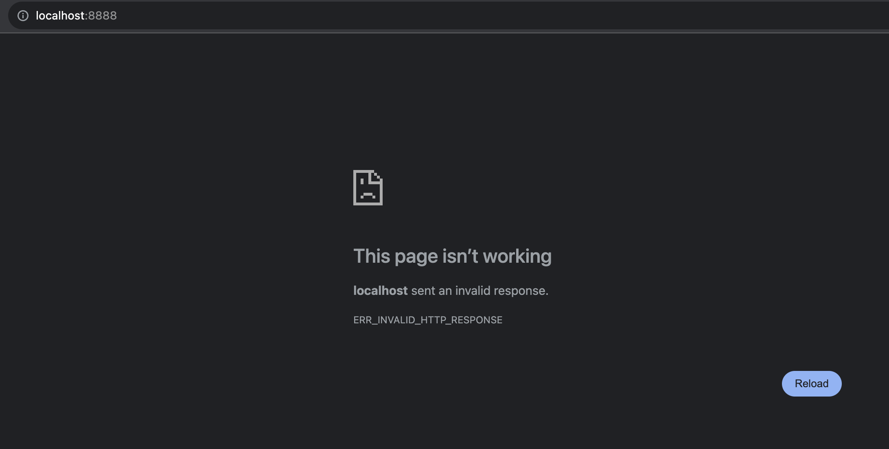
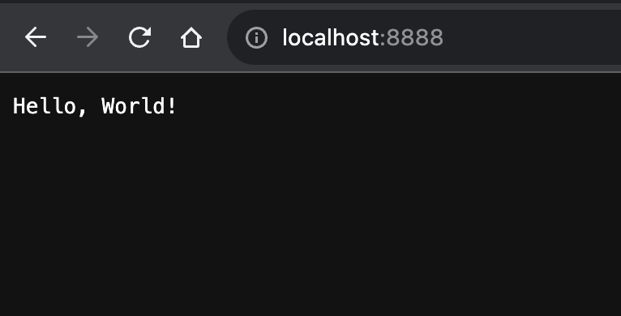
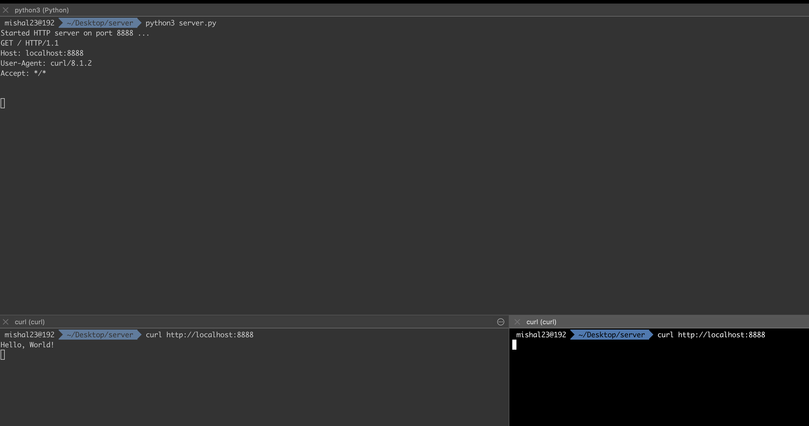
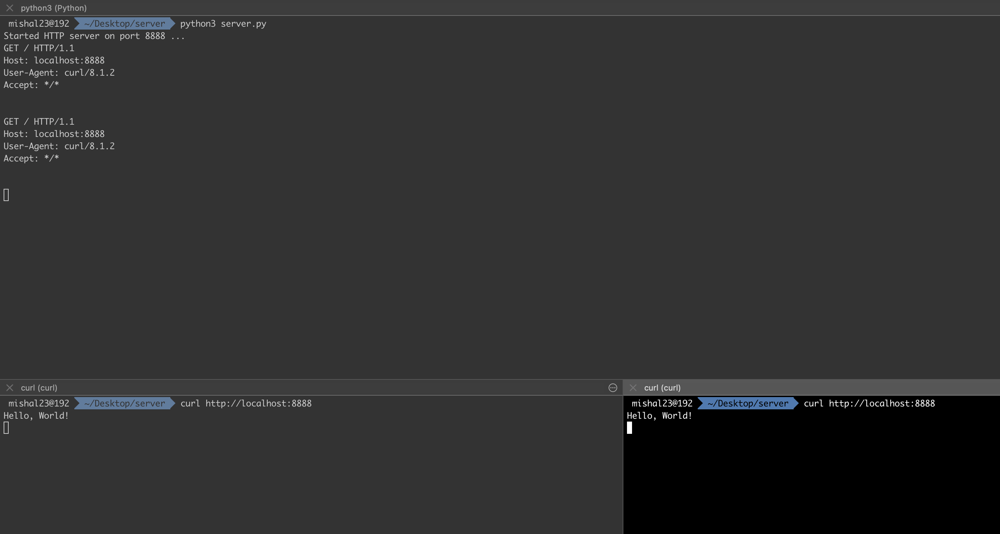

Whenever I ask this question on how to build a web server, most people misunderstand it as building a web server using one of the available frameworks like [Flask](https://flask.palletsprojects.com/en/3.0.x/), [Django](https://www.djangoproject.com/), [Ruby On Rails](https://rubyonrails.org/), [Express.js](https://expressjs.com/), but the question is much more on the building blocks how to create web server and not how to use frameworks.

Firstly, none of the names mentioned above (Flask, Django, Ruby On Rails, Express.js) are web servers, they're just frameworks. [Apache](https://httpd.apache.org/), [Gunicorn](https://gunicorn.org/), [Nginx](https://docs.nginx.com/nginx/admin-guide/web-server/) are few examples of web servers. With that being clarified, in this blog post, we'll go over how to build a very basic web server.

### What is a web server?

Web server is a software running on a hardware that would respond to the client requests made over the HTTP protocol. The client would usually be a web browser.

---

Now, how would a software running (server in our case) indicate that it is open for accepting connections. Client and the server connect to each other over the network, for which they use sockets. This socket is the TCP/IP socket on Unix systems. Assuming you know about sockets, the code for server would be as follows (_code is self-explanatory_):

```
import socket

HOST = ''
PORT = 8888

with socket.socket(socket.AF_INET, socket.SOCK_STREAM) as server_socket:
    server_socket.bind((HOST, PORT))
    server_socket.listen(1)
    print(f'Started HTTP server on port {PORT} ...')
    while True:
        client_connection, client_address = server_socket.accept()
        with client_connection:
            request_data = client_connection.recv(1024)
            print(request_data.decode('utf-8'))
            http_response = b"Hello World!"
            client_connection.sendall(http_response)
```

You could test the server using the `curl` command in the terminal.

```
curl http://localhost:8888
```

We're now ready with a very basic web server.

### Adhering HTTP Protocol Standards

If you start the server and connect it from the browser by entering the localhost:8888 URL from the browser, it would throw an error as for the response that we are sending from the server we are not adhering to the HTTP Protocol Standards.:



For a HTTP request, the protocol suggests three parts:

1. One line identifying the request type and path
2. An optional set of [RFC 822](https://datatracker.ietf.org/doc/html/rfc822) headers (ref: [RFC 2616](https://datatracker.ietf.org/doc/html/rfc2616#section-4))
3. An optional data part

Headers and data are seperated by a blank line. The first line of the request has the form:

`<command> <path> <version>`

- `<command>` Case-sensitive keyword such as GET or POST or DELETE, etc.
- `<path>` string containing path information for the request
- `<version>` protocol version ("HTTP/1.0" or "HTTP/1.1" or higher version)

For a HTTP response, again the protocol suggests three parts:

1. One line giving the response code
2. An optional set of [RFC 822](https://datatracker.ietf.org/doc/html/rfc822) style headers
3. The data

Again, headers and data are seperated by a blank line. The response code line has the form:

`<version> <responsecode> <responsestring>`

- `<version>` protocol version ("HTTP/1.0" or "HTTP/1.1" or higher version)
- `<responsecode>` 3-digit response code indicating success or failure of the request
- `<responsestring>` optional human-readable string explaining what the response code means

Thus, if you're developing a web server, you should handle these correctly. I wouldn't go into details of parsing the headers correctly, but [leaving a reference from the gunicorn web server code base on how they handle headers](https://github.com/benoitc/gunicorn/blob/430dcdd997b955fa1a8569a07d9cdcbac686fb35/gunicorn/http/message.py#L62). For the open question on the invalid response error on opening from the browser, that is easy to handle, just set the response body correctly as per the standards. Modify the `http_response` variable as below:

```
http_response = b"""\
HTTP/1.1 200 OK

Hello, World!
"""
```

It now works :)



### Handling multiple connections

The web-server wrote above cannot handle multiple connections. To prove that, after sending the response to the client, I added a sleep of 30 seconds in the code, and as you can see from the image below, the first client received the message but the other client didn't receive any response and once 30 seconds are passed, it receives the response. Thus, we know our server cannot handle multiple connections. Modified code can be found [here](https://gist.github.com/mishal23/e96ae1a967702f508171911ccd34e7b4#file-server-py).



To handle multiple connections, most web servers do it using the `fork()` command.

Let's understand `fork()` before going into the code, when `fork()` is called, it creates a copy of the existing process. The new process is called the child and the original process is called the parent. In python, on success it would return 0 in the child. <sup>[ref](https://docs.python.org/3/library/os.html#os._exit)</sup>.

Now, when the client creates a connection with the server, two same processes got created because we used `fork()`, so we will have to intelligently handle it.

---

In the child process, we should handle the following:

- since a copy of server socket is created, we should close it in the child and let it be as it is in the parent process.
- once the child process is processed, it should be closed gracefully using `os._exit()` as [per the docs](https://docs.python.org/3/library/os.html#os._exit).

In the parent process, we should handle the following:

- since a copy of client connection is created, and we're handling the request in the child process, we should close the duplicate client connection here.

Thus, the modified server side code to handle multiple connections is as follows:

```
import socket
import time
import os

HOST = ''
PORT = 8888

with socket.socket(socket.AF_INET, socket.SOCK_STREAM) as server_socket:
    server_socket.bind((HOST, PORT))
    server_socket.listen(1)
    print(f'Started HTTP server on port {PORT} ...')
    while True:
        client_connection, client_address = server_socket.accept()
        with client_connection:
            pid = os.fork()
            if pid == 0:
                server_socket.close()  # close copy of the socket
                request_data = client_connection.recv(1024)
                print(request_data.decode('utf-8'))
                http_response = b"""\
HTTP/1.1 200 OK

Hello, World!
                """
                client_connection.sendall(http_response)
                time.sleep(30)
                os._exit(0)  # child exits here
            else:
                client_connection.close()  # close the copy of parent client connection
```

As you can see in the image below, multiple connections are now working, response was served immediately and both are waiting for 30 seconds as per the sleep in the code:



Even, gunicorn uses `fork()` to handle multiple connections as it can be seen in [the codebase](https://github.com/benoitc/gunicorn/blob/430dcdd997b955fa1a8569a07d9cdcbac686fb35/gunicorn/arbiter.py#L587).

> Threading shouldn't be used as it is part of the same process and sharing the same data, it can cause issues in dealing with multiple clients.

---

This completes building a basic web server that can handle multiple connections. There are still a lot of things to handle like logging, HTTPS connections, security, caching and providing integration with web frameworks, but hope this gives you an idea on creating a basic web server. Web frameworks would handle the routing, authentication, database access, business logic etc., and is usually not the responsibility of the server.
