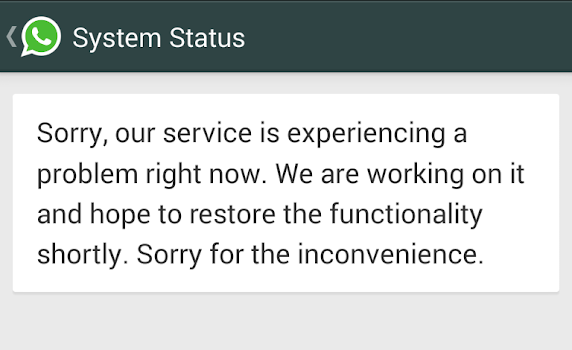

## Introduction

Many of us would have heard about the two major WhatsApp outages recently when it was down for about an hour each time. For the general public, WhatsApp was down for an hour. But for software engineers, WhatsApp was back within an hour. This made me wonder what it was that enabled the engineers working at WhatsApp to restore the services so fast.

What if I tell you, it was a very **normal** turbulent production failure for them. Yes, huge companies like [Netflix](https://www.netflix.com/in/), [Facebook](https://www.facebook.com/), and [Google](https://www.google.co.in/) use a method of engineering called **Chaos Engineering**.

To explain Chaos Engineering in layman terms :
To be good at something, if one practices it in extreme conditions, it would be easier for the person to perform normally. Similarly, if a software engineer has seen extreme conditions in production, it becomes a challenge for him/her to code in such a way that their service fails if such an extreme situation occurs. If at all it comes, they would have experienced it before, and so it becomes easy to bring the services back.

## Principle of Chaos Engineering

The main idea of Chaos Engineering is to inject failures to be prepared for the worst conditions intentionally.
A formal definition for Chaos Engineering given by Netflix:
> Chaos Engineering is the discipline of experimenting on a distributed system to build confidence in the system's capability to withstand turbulent conditions in production.

Chaos Engineering can be thought of as the facilitation of experiments to uncover systemic weaknesses. These experiments follow four steps:

1. Start by defining 'steady state' as some measurable output of a system that indicates normal behavior.
2. Hypothesize that this steady-state will continue in both the control group and the experimental group.
3. Introduce variables that reflect real-world events like servers that crash, hard drives that malfunction, network connections that are severed, etc.
4. Try to disprove the hypothesis by looking for a steady-state between the control and experimental groups.

The harder it is to disrupt the steady-state, the more confidence we have in the system's behavior. If a weakness is uncovered, we now have a target for improvement before that behavior manifests in the system at large.
In layman terms, break your system, see the difference between steady-state and experimental state, lesser the difference, and lesser it will break in production. If the difference is more, you have a target for improvement before actually experiencing it in production.
	
## Practical Use

Netflix, a pioneer in the field of Chaos Engineering, uses a tool called Chaos Monkey. It randomly picks a server from production deployment on AWS (Amazon Web Services) and kills it. Executives at Netflix knew that server failures are guaranteed to happen, and they wanted servers to fail during working hours so that it could be fixed in the presence of their engineers. They knew that they could rely on engineers to build resilient solutions if they were given context to expect servers to fail. If they could align their engineers with building services that survive a server failure, then it wouldn't be a big deal when it happened.

## How can it help you?

Suppose your team has built the next wave of advancement the whole world has been waiting for. You are to launch your service, but questions are rumbling in your mind:

* Is your application ready for production?
* Will the system survive the failures of other companies you are dependent on?
* Will the system survive the failure of your own configurations?

The truth is: You can never be sure. There will always be something that can be wrong or will go wrong. Some things aren't in your control, like denial-of-service attacks or network failures. Sometimes, bad things happen.

Possibly The only solution for it is to build quality software that is resilient to failures. As the saying goes - * "Hope for the best, prepare for the worst "*
But how can your team be sure that your system is ready for production and is prepared to face all difficulties/failures? *This is where Chaos Engineering comes into the picture.*

## Does this seem like testing?

It may indeed sound like it, but it isn't testing. Chaos Engineering is an experiment on the production environment, and there is certainly no way to accurately duplicate the production environment at scale (as in testing). The experiment itself will have a systemic effect that could change your results, so the only way to accurately build conflict in the system you have now is to experiment on it.

## Conclusion

The purpose of Chaos Engineering is to experience disastrous conditions. This might sound like a difficult task, and it does require a lot of creativity, but the extra effort is worth it. You must inject failures in your system such that certain parts of your infrastructure becomes unavailable. Some examples are: terminate cluster machines, kill worker processes, delete database tables, cut off access to internal-external services, etc. Later you can also simulate events capable of disrupting steady-state like high latency due to slow networks.

These experiments are a bit difficult, but whatever you decide to do, you'll be surprised at how much you can learn from chaos.
There are a lot of tools worth mentioning :

* [Chaos Monkey](https://github.com/Netflix/chaosmonkey) - A resiliency tool that helps applications tolerate random instance failures
* [The Simian Army](https://github.com/Netflix/SimianArmy) - A suite of tools for keeping your cloud operating in top form
* [kube-monkey](https://github.com/asobti/kube-monkey) - An implementation of Netflix's Chaos Monkey for Kubernetes clusters
* [Gremlin Inc.](https://www.gremlin.com/) - Failure as a Service
* [Pumba](https://github.com/alexei-led/pumba) - Chaos testing and network emulation for Docker containers (and clusters)
* [Chaos Toolkit](https://github.com/chaostoolkit/chaostoolkit) - A chaos engineering toolkit to help you build confidence in your software system
* [orchestrator](https://github.com/github/orchestrator) - MySQL replication topology management and HA

I hope you got an idea about Chaos Engineering - a powerful approach to build resilient systems!