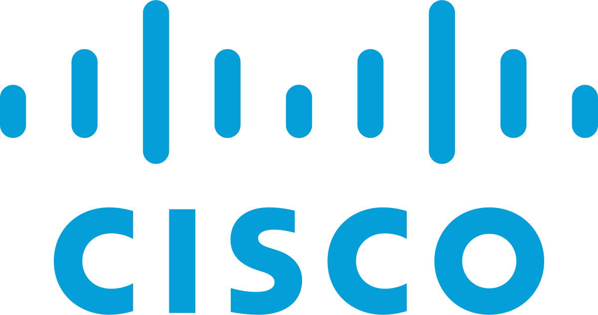

I joined [NITK, Surathkal](https://nitk.ac.in/) in 2016 to pursue Bachelors in Computer Science & Engineering with some dreams, which I can't even recall right now. But sure the immature, playful, under-confident kid has a lot of things changed in himself, thanks to the college, friends, family, and everyone out there who've helped each other grow throughout the journey.

I had done two internships in my college life (one at an university lab at IIIT Hyderabad and the other one in the open-source community under the [GSoC program](https://summerofcode.withgoogle.com/)), however, this is going to be my first experience working in this big a firm and in a corporate culture. I was pretty excited to begin it in-person, though current circumstances have made things work from home, hopefully, my experience working remotely last summer would be helpful. 😉

I have joined the Engineering Business Unit at Cisco, working with the IoT Department, and reporting to my manager [Joe Karimundackal](https://linkedin.com/in/joe-karimundackal-426289). 

Really excited about the role and to learn a lot of new things in this journey. Hoping for the best for the new chapter of life! 🤞

If you've any advice for me to get started in the corporate life, would love it if you share it! I'll update this article with your name and the advice for others to read.

**\#WeAreCisco** **\#LoveWhereYouWork**

