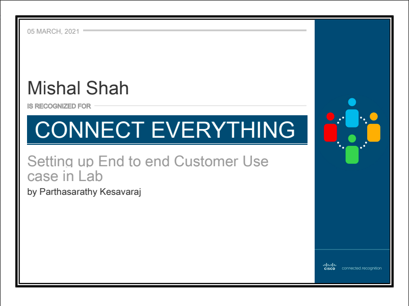
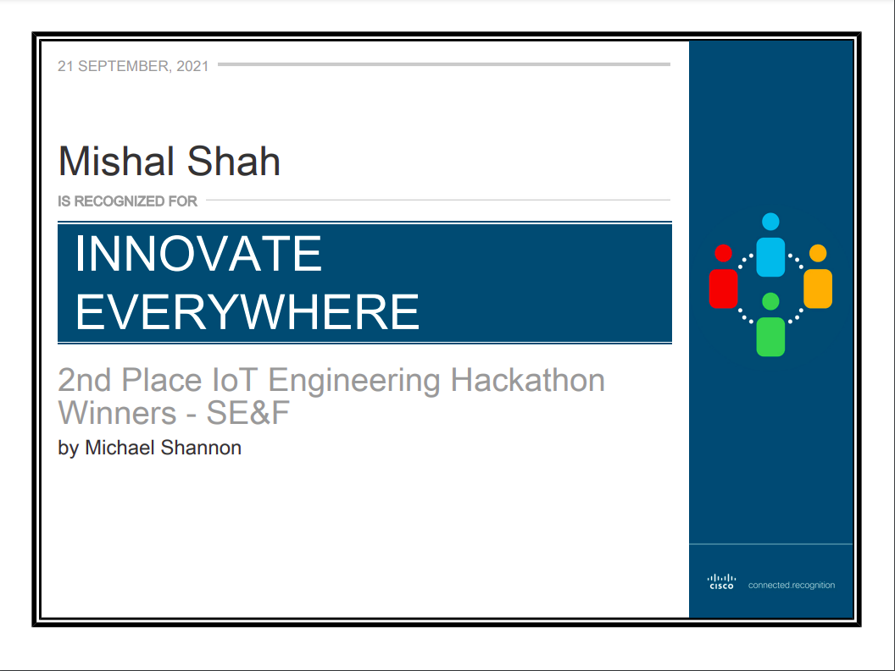

I [joined Cisco](/joining-cisco) on 5th August 2020 as a software engineer straight out of graduating from college, and 24th October 2021 was my last day at Cisco. I had never imagined having such a short stint at Cisco (1 year, 1 month, 19 days), but some things changed so much fast that a change was inevitable.

I want to reflect on my experience working with Cisco and have nothing but immense gratitude for everyone at Cisco who has helped me grow during my time.

## Year of Learnings

"Year of Learnings" - yes, that's how I would describe the experience because of the learning curve I had.
Throughout my college time, I mainly developed web applications, and I was eager to work on something other than web applications, and Cisco gave me that opportunity. I worked on edge computing using C++17 as the language and heavily learned concepts like templates, threads, pointers, debugging using gdb, and many more topics in C++. Apart from programming, I learned about IoT protocols like MQTT, Serial, Modbus, and Azure IoT SDK. Apart from all this, working at a corporate with quite a lot of people involved in a much more process-oriented method was one of the most significant takeaways and still blows my mind when I think more about it. My learning curve was steep; reviewing PRs and taking part in design discussions, mentoring folks, debugging/reproducing customer issues was also quite fruitful. I planned to write some blogs about the things I got a chance to explore, but unfortunately, it's in the backlog. I am hoping to get it cleared soon.

I got a chance to work on an OKR with a technical lead to set up a customer scenario for our product which was a big breakthrough considering the hardware dependency and the limited knowledge. One thing that made me love the organization was that the work you put in doesn't get unnoticed, and I was recognized for this activity by my manager. Since this was the first major award after joining Cisco, I was pretty proud of this achievement.

The culture at Cisco/IoT department was to give the engineers space and time to innovate, and keeping in mind that, the departments organized a few hackathons. One such hackathon was on **Fuzzing and Symbolic Execution**. It was an entirely new topic for most of the team members. Since all of us were in-experienced (less than a year at Cisco) at this topic and to Cisco, we were skeptical about participating. Still, after some motivation from our manager, we went ahead and participated. We were surprised with the collaboration and the learnings that our entire team got, and the results were just a cherry on the cake - as we became the runners-up in the hackathon!

If I look back, Cisco helped grow not just technically but also personally quite a lot. I also made some mistakes, but my manager and team would always back and support me.

## Why I left?

> Mishal, all is looking so good, why did you leave?

Even I asked the same question to me not once but more times than you would think. Since it's already done, I don't want to go over that over-thinking process, but I finally decided to move out of Cisco to explore something different and a different workplace. One more factor had made me a bit uncomfortable and was one of the factors involved in making the decision, but I'd leave it for some other time.

> Ok, fair enough, but what's next?

I got lucky to get an opportunity at a different workplace, so I've decided to join that company and experience a new world!

## Concluding

I feel Cisco is a great place to work and have immense respect for the company and its work. The way they care for their employees, their policies for employees, and the humbleness and caring nature of all the colleagues and leaders is excellent. The opportunities that Cisco gave me and the support I got from leaders were commendable. I have immense gratitude to everyone at Cisco, and I'll carry a lot of lessons learned from Cisco to wherever I go.

Thank you, Cisco, and especially to my managers, colleagues, and leaders for making the experience much better! Until next time.
