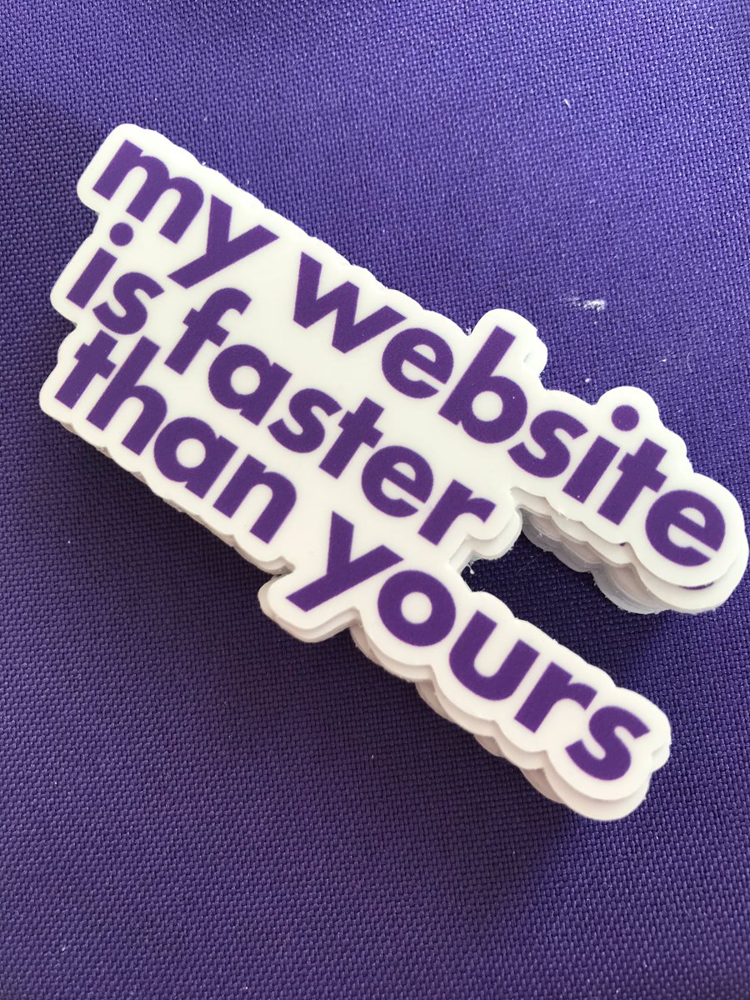
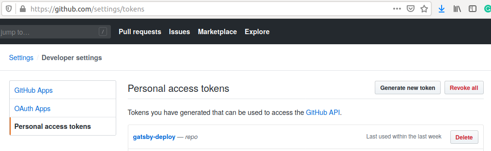
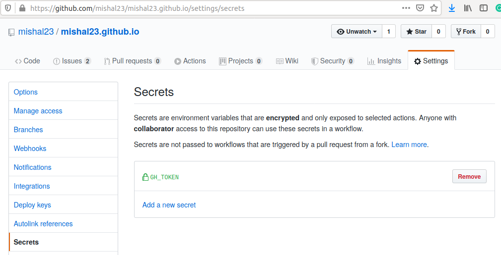

I had started building my personal website in 2017 with static HTML, CSS, JS, and in 2018 based on the available options, I went ahead with Jekyll. Overall, everything was working fine with Jekyll and was smooth. Although, my Twitter feed was filled with [Gatsby](https://www.gatsbyjs.org/), and I had seen some stickers named "My Website is faster than yours" of Gatsby while interacting with them for [HackVerse Hackathon](https://hackverse.nitk.ac.in).



This made me look at some of the Gatsby sites, and it felt that the websites were fast, and it had the support of PWA, something I wanted on my site. Moreover, since it was based on React, I decided to try out to move my personal website from Jekyll to Gatsby.

## The Migration

I won't be listing the steps in detail on how I migrated because there are plenty of blogs out there, and the documentation provided by Gatsby is excellent. I could get anything I wanted on the Gatsby documentation. I started looking into the tutorial of Gatsby to get the hang of it, and started my new website with the default starter code.

Here are the significant steps:
- Started looking into the [tutorial](https://www.gatsbyjs.org/tutorial/),
- Took the gatsby default starter code,
- Added the inital components (`sidebar`, `post`, `default`), and set up the basic styling as per the old website,
- Added the content for the non-blog pages (`about`, `projects`, `contact`, `404`),
- Setup blog page component view (blogPost) from markdown pages using the `onCreateNode`, `createPages` APIs,
- Learned a bit about using GraphQL and GraphiQL UI,
- Exported all the blog posts from the previous site,
- Index Page Display to list all the blog posts (`blogList`),
- Added SEO for all pages,
- Added automatic deployment with TravisCI,
- Added Google Analytics & PWA support,
- Some other fixes for overall look & feel.

Here's the lighthouse report on the new website:


## GitHub Actions

When GitHub Actions was released in [August 2019](https://github.blog/2019-08-08-github-actions-now-supports-ci-cd/), I always wanted to give it a try for some project but didn't get enough time to try it out. While I was using Travis CI with this deployment, I thought of giving GitHub Actions a try. Finally!

Here are the steps I followed:

- Generated a New Token from GitHub ```Settings -> Developer Settings -> Personal access tokens``` with **repo** access scope.


- I was deploying on my root github.io, so the name of my repo is mishal23.github.io, I added the token in the repository ```Settings -> Secrets``` with the name ```GH_TOKEN```


- Created a file named `gh-pages-deploy.yml` in the directory ```.github/workflows/``` using the Simple Workflow template available under the Actions tab on the repository.
- Since the User pages must be built from the master branch, I set my default branch as **source** on the repository and left the master branch for deployment and hence triggered the workflow only on **source** branch push,
- I configured it to node.js environment with **12.x** version, cached the dependencies so that it doesn't have to be installed every time and faster CI,
- Configured to initial git settings of user.name and user.email as it is required, used to **GH_TOKEN** to give the access and then made the deployment run using the following command:
```bash
npm run deploy
```

That's it! Pretty simple! Really like the simplicity of GitHub Actions. Find the complete configuration file [here](https://github.com/mishal23/mishal23.github.io/blob/source/.github/workflows/gh-pages-deploy.yml)


## Conclusion

The migration was definitely worth it. The site is blazing fast 🚀 and, moreover, got to pick up some new skills. I would recommend anyone to migrate to gatsby. There are certain features and fixes which I plan to do in due time. If you need any further help, feel free to take a look at [the repo](https://github.com/mishal23/mishal23.github.io/) or [contact me](/contact) If there are any issues you come across, please do open up [here](https://github.com/mishal23/mishal23.github.io/issues) or would love it if you fix it :)