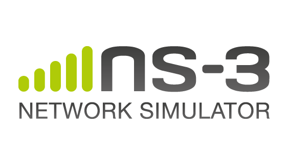

Excerpt from the [previous post](../journey-to-gsoc-2019): Got accepted for GSoC 2019 with the [ns-3 organization][ns3-gsoc].

The previous post mainly covered my journey to GSoC 2019, but I didn't speak anything about the organization and the project. This post is targetted to cover that.

## About ns-3

ns-3 is a discrete-event network simulator for Internet systems, targeted primarily for research and educational use. ns-3 is publicly available for research, development, and use.

The goal of the ns-3 project is to develop a preferred, open simulation environment for networking research: it should be aligned with the simulation needs of modern networking research and should encourage community contribution, peer review, and validation of the software.

I had previously worked with ns-3 to implement [TCP New Vegas in ns-3][tcp-newvegas] in the Computer Networks course project.

The project that I'll be working on during GSoC is: [Improving the ns-3 AppStore and linking with Bake][gsoc-project]

## About ns-3 AppStore

The ns-3 AppStore is a supplemental web site allowing users to find and learn about extensions to the mainline ns-3 releases.

### Motivations for the ns-3 AppStore

- Provide a central place for structured information about ns-3 extensions,
- Move the ns-3 project towards a more federated development environment with a smaller core,
- Provide guidelines to reduce the software incompatibility between various extensions.

## About Bake

Bake was developed to automate the reproducible build of ns-3, taking into account that this build may be composed of a number of interdependent projects. Bake was developed to simplify the assembly of these pieces of software in a coherent and useful way. It is a tool for coordinated software building from multiple repositories, developed for the ns-3 project.

### Existing Features in Bake

- Automatic handling of dependencies
- Automatic download of the required sources
- Automatic correct build of the required modules
- Off-line installation and build capabilities

## GSoC Project

ns-3 has certain modules into its core and quite of them are also made by researchers/developers, however, to reduce the size of the core, not all modules are merged into the mainline of the ns-3 and are maintained separately with the flexibility to use them by downloading the module in the `contrib/` directory of the ns-3. The AppStore maintains the modules developed by the researchers/developers. Although the ns-3-AppStore and the Bake build system exist, both of them function independently. If the AppStore and the Bake build system start interacting with each other, it will be easier for the developers to install the new modules. That's the project goal! Make it easier for the ns-developers to install new modules. While installing a module is done, other features such as updating the module, searching for a module, and fetching the module configuration file will also be supported. The AppStore will need to send necessary configuration files and other details through REST APIs and then add command-line features to bake, which would eventually download the module repo, install the required dependencies and finally build the source tree.

Since the ns-3-AppStore uses Python2.7 and Django 1.8, one of the tasks will also be to upgrade it to the latest versions to keep up with the technology and also since Python2.7 support is going to end by January 2020. Some additional features to the ns-3-AppStore, such as multi-threaded comments and download statistics for the modules, are also planned.

## Community Bonding Period

The community bonding period has ended. It mainly focused on setting up the development environment and understanding the code base of the Bake build system, testing and understanding the existing functionalities, and the workflow. My mentor also suggested that I research the various cases and develop a strong plan so that the coding period stays smooth. I also started documenting the ns-3-AppStore: user-workflow and the user-guide, which helped me better understand the existing functionalities of the AppStore.

[ns3-gsoc]: https://summerofcode.withgoogle.com/organizations/4845767460651008/
[gsoc-project]: https://summerofcode.withgoogle.com/projects/#5385832846852096
[tcp-newvegas]: https://github.com/mishal23/Implementation-of-TCP-New-Vegas-in-ns3/
