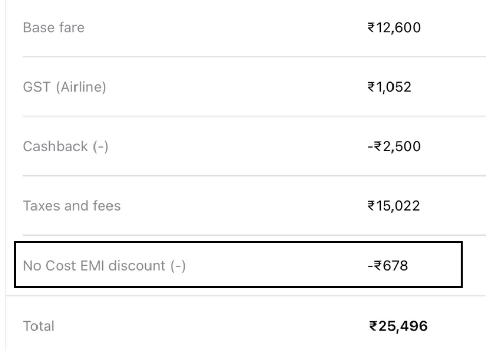

I recently had to make a booking and there was discount applicable on choosing the No Cost EMI option by paying through credit card, and to avail the discount I chose the option. I tried searching on the details if there's any hidden cost associated by using No Cost EMI but didn't find anything concrete.

Once I availed the No Cost EMI, I figured out all the charges associated with it, so penning it down here for anyone who would face the same questions.

## Breakdown of a No Cost EMI transaction

No Cost EMI doesn't mean interest is not charged, as per RBI guidelines any loan should have an interest amount associated with it. So the vendor (from where you avail No Cost EMI) bears the interest and gives it as a discount on your total amount.

For eg. As shown in figure below, the vendor gave a discount of Rs. 678 on the total amount equivalent to the interest **as per their calculation**.

## The Catches

All seems fair till here, now starts all the catch on the actual costs. We'll start with the easiest and direct ones and go to more details.

### Processing fee

The bank charges processing fee for every loan you create, and thus you're charged and the vendor doesn't compensate for you. Usually the processing fee for credit card No Cost EMIs are Rs. 199 + 18% GST = Rs. 235.

### Calculation of the interest

The vendor calculates the interest assuming the loan starts from today, but the actual interest charged by the bank is little different. When we avail the no cost EMI using credit card, the amount of each installment is charged on the day of the credit card billing date.

For eg. If the credit card billing date is 15th of every month, the installment amount will be added in that credit card bill.

So now, let's assume you booked your tickets/ordered an item on the 16th of July with 3 months as the No Cost EMI option, it would take 2 days for the loan to get generated, and thus your loan got registered on 18th July. Now as per credit card billing cycle, you would be charged for installments on 15th August, 15th September, 15th October and you pay the amount by the credit card due date which would be around T + 25 (T being the credit card billing date). So technically your EMI would be for greater than 3 months by around 20-25 days.

The bank won't let go the interest for those extra days and charge the customer for it and thus your first interest will be significantly higher. So although the vendor gave you an discount, it doesn't account for the cycle of your credit card bill and thus that extra amount needs to be paid by the customer.

In my case, the total interest charged to me by the bank was Rs. 915. That amounted to me paying Rs. 237 (Rs. 915 - Rs. 678) extra on the discount that the vendor gave.

### GST on the interest

As per RBI guidelines, you're charged 18% GST on the interest for every EMI. Again, the vendor doesn't compensate for it.

In my case, total interest was Rs. 915, so the GST was Rs. 165 (Rs. 915 \* 0.18).

### No Reward points

For EMI transactions, you don't get any reward points by the credit card and if you're someone who uses these reward points, you're definitely losing out on that benefit.

In my case, I get 4 reward points for every Rs. 150 spent, so I lost around 680 points (25496 \* 4 / 150) which roughly translates to Rs. 340 (1 reward point = Rs 0.5).

## Overall Loss

The overall amount that you'll be paying over the EMI is:

- Processing fee
- Extra interest due to billing cycle
- GST on the interest
- Loss on reward points

In my case, the total amount I missed out was Rs. 978. Now the amount is not significant, but when you advertise a product as a **No Cost** and charge these hidden charges without clearly mentioning, it's not the best place to be in.

## What can you do?

If you still want to go ahead with the No Cost EMI, _if you can_, preclose the loan as soon as it's generated, that way you'll be losing out only on the processing fee and the reward points. The preclosure charges are usually Rs. 0 for such things.

> Disclaimer:
> All the details mentioned above were through Cleartrip vendor and the HDFC Bank credit card, charges might differ with vendors and other banks/cards. Please do due diligence.
