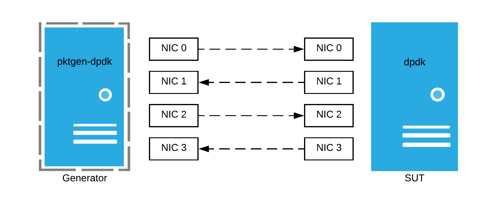
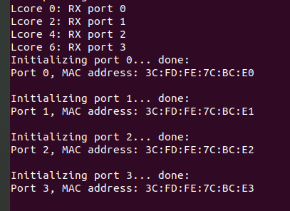

> This article is co-authored by [Mehnaz Yunus](https://www.linkedin.com/in/mehnaz-yunus/)

As part of the evaluation stage of our bachelor thesis, we set up a testbed for running forwarding applications in DPDK and with Pktgen-DPDK as the traffic generator. In this blog, we aim to cover

- how to run Pktgen-DPDK using Lua scripts in some complex scenarios
- how to run L2fwd, L3fwd (with exact match and longest prefix match) and L3fwd power DPDK applications.

We weren't able to find a lot of resources for setting up these tests and with this blog, we aim to bridge the gap.

## DPDK and Pktgen-DPDK

The Data Plane Development Kit is an Open source software project managed by the Linux Foundation. It provides a set of data plane libraries and network interface controller polling-mode drivers running in userspace. This way, the NIC is directly accessible by the DPDK application.  The advantage of using DPDK is that you're able to utilize the link speed completely whereas, in the standard packet processing, the link goes underutilized. Thus, high performance can be achieved with DPDK. 

Pktgen-DPDK is a software-based traffic generator powered by DPDK. Traffic generators are often used to simulate various situations and test the performance of the application. 

## Test Setup

All the tests were done with two systems, one as the **System Under Test** which is a bare metal server, and the other one as a **generator** which is a VM. The SUT has two NUMA sockets where each socket has two 14-core Intel Xeon Gold 5120 2.20 GHz processors, which has four Intel I350 10 Gigabit NICs and four Ethernet Controller X710/X557-AT 10GBASE-T NICs. The generator has two 12-core Intel Xeon Gold 5120 2.20 GHz processors, 94GB memory, and one Intel 82540EM Gigabit NIC and Ethernet Controller X710/X557-AT 10GBASE-T NICs. Each system runs Ubuntu 20.04 LTS. 

Installation of both DPDK and Pktgen-DPDK was done by compiling from source. igb_uio kernel driver was used and 2048 huge pages were allotted. Our systems had 4 NICs so we could utilize them, if your system doesn't have that many NICs, you could use tapped interfaces. Here's a diagrammatic representation of the setup.



## Lua Scripts with Pktgen-DPDK

We used Lua scripts to automate the process of setting parameters and configuring flows in Pktgen-DPDK. Pktgen-DPDK can be run on the generator using the command shown below. It is run in promiscuous mode with the first four cores (0,1,2,3), and 4 memory channels. The Lua script for each application is mentioned using the -f option. The port mapping to cores is done as:

- core 1 handles port 0, 1 RX/TX
- core 2 handles port 2, 3 RX/TX.

> 💡 Note: The core 0 is used for keyboard, timer, and screen output and hence shouldn't be used for port mapping. pktgen-dpdk with Lua script should be run from the pktgen directory only, otherwise it gives error.

```
sudo ./app/x86_64-native-linux-gcc/pktgen -c 0xf -n 4 -- -P -m 1.[0-1] -m 2.[2-3] -f /path/to/script.lua
```

### Situation 1: Long Running Flow for Certain Time

We were required to run tests where the packets were sent for a fixed time period. Since pktgen by default doesn't support timers, we used os functions for the same.

```lua
local port = "0";
local send_for_secs = 120;
pktgen.start(port);
local start_time = os.time();

while os.difftime(os.time(), start_time) < send_for_secs do
    sleep(1);
end

pktgen.stop(port);
```

where send\_for\_secs is the time for which we want to send.

> 💡 Note: sleep(send\_for\_secs) was not used because it would block Pktgen's output refreshing. So continuous check after a second and checking until the difference reaches the send\_for\_secs is done here.

### Situation 2: Different Packet Size and Rate

We also wanted to test with different packet sizes and rates (rate in pktgen-dpdk is to be given as a percentage of the line rate). Since changing the packet size or rate in the Lua script after every run is tedious, we ask for user input for the packet size and rate at runtime using the script below.

```lua
local pktSize = tonumber(pktgen.input("Enter the size of packets to send: "));
if pktSize == nil then
    pktSize = 64;
end
pktgen.set(port, "size", pktSize);

local rate = tonumber(pktgen.input("Enter the sending rate: "));
if rate == nil then
    rate = 100;
end
pktgen.set(port, "rate", rate);
```

## Forwarding Applications in DPDK

We mention the steps to run the forwarding application and a corresponding Lua script to set relevant parameters. The command to run Pktgen-DPDK with the Lua script has been given in the previous section.

### l2fwd

Layer 2 forwarding (switching) does not need IP addresses to work. Thus, we set only the MAC address in the packets sent from pktgen-DPDK. 

- **Start the l2fwd application on the SUT:** The l2fwd example can be run with the following command on the SUT. This command starts l2fwd on four cores and with four ports. The SUT has two NUMA sockets but we use only one. The even-numbered cores are on socket 0 and we use the first four cores on it, i.e, cores 0,2,4,6. Thus the core mask is given as 0x55. The port mask is 0xf as we use four ports.

```
sudo ./${RTE_SDK}/examples/l2fwd/${RTE_TARGET}/app/l2fwd -c 0x55 -n 4 -- -p 0xf
```



- **Start pktgen-dpdk on the generator with Lua script:** Get the MAC address of the ports by starting the l2fwd application on the SUT. Set them as the destination MAC address for the ports 0 and 2 in pktgen through the Lua script shown below.

```lua
local port0 = "0";
local port2 = "2";

local port0_mac = "3C:FD:FE:7C:BC:E0";
local port2_mac = "3C:FD:FE:7C:BC:E2";

pktgen.set_mac(port0, "dst", port0_mac);
pktgen.set_mac(port2, "dst", port2_mac);

-- code for taking user input for packet size and rate
-- setting the packet size & rate

pktgen.start(port0);
pktgen.start(port2);

-- code to check time to run

pktgen.stop(port0);
pktgen.stop(port2); 
```

### l3fwd

A layer 3 forwarder matches the destination IP of an incoming packet to the entries stored in its forwarding table and updates the layer 2 header before sending the packet to the next-hop.

### Longest Prefix Match

For the LPM method, an LPM object is used to emulate the forwarding stage for IPv4 packets. The LPM object is used as the routing table to identify the next hop for each input packet at runtime. The example can be run with the following command on the SUT.

```
sudo ./${RTE_SDK}/examples/l3fwd/${RTE_TARGET}/app/l3fwd -c 0x55 -n 4 -- -P -p 0xf --config=(0,0,0),(1,0,2),(2,0,4),(3,0,6)
```

The IP addresses obtained from the [source code](https://github.com/DPDK/dpdk/blob/466032ef8012a7fddd8dda986c5977e9341e3c35/examples/l3fwd/l3fwd_lpm.c#L46) of l3fwd are set as shown below.

```lua
local port0 = "0";
local port1 = "1";
local port2 = "2";
local port3 = "3";

pktgen.set_ipaddr(port0, "dst", "198.18.1.1");
pktgen.set_ipaddr(port0, "src", "198.18.0.1");
pktgen.set_ipaddr(port1, "dst", "198.18.0.1");
pktgen.set_ipaddr(port1, "src", "198.18.1.1");

pktgen.set_ipaddr(port2, "dst", "198.18.3.1");
pktgen.set_ipaddr(port2, "src", "198.18.2.1");
pktgen.set_ipaddr(port3, "dst", "198.18.2.1");
pktgen.set_ipaddr(port3, "src", "198.18.3.1");

-- code for taking input of packet size, rate from the user
-- setting the packet size & rate

pktgen.start(port0);
pktgen.start(port2);

-- code to check time to run

pktgen.stop(port0);
pktgen.stop(port2);
```

### Exact Match

In the exact match lookup method, the forwarding is based on a hash for which a hash object is used to emulate the flow classification stage. The example can be run with the following command on the SUT. The -E parameter selects the exact match method.

```
sudo ./${RTE_SDK}/examples/l3fwd/${RTE_TARGET}/app/l3fwd -c 0x55 -n 4 -- -P -E --parse-ptype -p 0xf --config=(0,0,0),(1,0,2),(2,0,4),(3,0,6)
```

From the code for the l3fwd application, the exact match works only with TCP packets and thus we set the protocol as TCP in the packets generated from pktgen. The exact match is based on the combination of IP addresses and port numbers, as seen in the routing table in the code. We set the IP addresses and destination and source ports as shown below obtained from the [source code](https://github.com/DPDK/dpdk/blob/466032ef8012a7fddd8dda986c5977e9341e3c35/examples/l3fwd/l3fwd_em.c#L102).

```lua
local port0 = "0";
local port1 = "1";
local port2 = "2";
local port3 = "3";

pktgen.set_ipaddr(port0, "dst", "201.0.0.0");
pktgen.set_ipaddr(port0, "src", "200.20.0.1");
pktgen.set_ipaddr(port1, "dst", "101.0.0.0");
pktgen.set_ipaddr(port1, "src", "100.10.0.1");

pktgen.set_ipaddr(port2, "dst", "211.0.0.0");
pktgen.set_ipaddr(port2, "src", "200.40.0.1");
pktgen.set_ipaddr(port3, "dst", "111.0.0.0");
pktgen.set_ipaddr(port3, "src", "100.30.0.1");

pktgen.set(port0, "sport", 12);
pktgen.set(port0, "dport", 102);
pktgen.set(port1, "sport", 11);
pktgen.set(port1, "dport", 101);

pktgen.set(port2, "sport", 12);
pktgen.set(port2, "dport", 102);
pktgen.set(port3, "sport", 11);
pktgen.set(port3, "dport", 101);

-- code for taking input of packet size, rate from the user
-- setting the packet size & rate

pktgen.set_proto("all", "tcp");

pktgen.start(port0);
pktgen.start(port2);

-- code to check time to run

pktgen.stop(port0);
pktgen.stop(port2);

```

### l3fwd-power

The L3 Forwarding with Power Management application is an example of power-aware packet processing using the DPDK. The example can be run with the following command on the SUT.

```
sudo ./${RTE_SDK}/examples/l3fwd-power/${RTE_TARGET}/app/l3fwd-power -c 0x55 -n 4 -- -P -p 0xf --config=(0,0,0),(1,0,2),(2,0,4),(3,0,6)
```

The flow configured on pktgen with IP addresses can be done as below. The IP addresses are obtained from the [source code](https://github.com/DPDK/dpdk/blob/466032ef8012a7fddd8dda986c5977e9341e3c35/examples/l3fwd-power/main.c#L339) of l3fwd-power. It runs the longest prefix match by default.

```lua
local port0 = "0";
local port1 = "1";
local port2 = "2";
local port3 = "3";

pktgen.set_ipaddr(port0, "dst", "1.1.1.1");
pktgen.set_ipaddr(port0, "src", "2.1.1.1");
pktgen.set_ipaddr(port1, "dst", "2.1.1.1");
pktgen.set_ipaddr(port1, "src", "1.1.1.1");

pktgen.set_ipaddr(port2, "dst", "4.1.1.1");
pktgen.set_ipaddr(port2, "src", "3.1.1.1");
pktgen.set_ipaddr(port3, "dst", "3.1.1.1");
pktgen.set_ipaddr(port3, "src", "4.1.1.1");

pktgen.set(port0, "sport", 12);
pktgen.set(port0, "dport", 102);
pktgen.set(port1, "sport", 11);
pktgen.set(port1, "dport", 101);

pktgen.set(port2, "sport", 12);
pktgen.set(port2, "dport", 102);
pktgen.set(port3, "sport", 11);
pktgen.set(port3, "dport", 101);

-- code for taking input of packet size, rate from the user
-- setting the packet size & rate

pktgen.set_proto("all", "tcp");

pktgen.start(port0);
pktgen.start(port2);

-- code to check time to run

pktgen.stop(port0);
pktgen.stop(port2);
```

## Conclusions

In this article, we looked at running various forwarding applications of DPDK with pktgen-dpdk as the traffic generator with four ports. The main challenge we faced while trying to run these applications was a lack of proper documentation in setting up various cases with pktgen and making sure the traffic forwards on the application and reaches back to the other port. If you do not configure the IP/MAC address properly, it is possible that the packets do not reach the other port but come back on the same port. We hope with this blog, you'll be able to configure your flows with ease. 

Both DPDK and pktgen-dpdk require a bit of work to set up and understand how the applications work, and undoubtedly there is a good learning curve. The DPDK documentation is quite detailed on running the DPDK applications and thus, we've not gone much into deep covering it but concentrated on pktgen-dpdk.

The complete Lua scripts can be found [here](https://gist.github.com/mishal23/f16dd3fde15695b18d8a52dc11dd8cf0)

## Acknowledgment

We thank our project guide, [Dr. Mohit P. Tahiliani](https://www.linkedin.com/in/mohittahiliani/), and mentor Leslie Monis for their continuous guidance throughout the course of the project and our project teammate [Pavan Vachhani](https://github.com/vachhanihpavan/) for his valuable contribution to the final project. 

## References

- DPDK Sample Application Guide: [l2fwd](https://doc.dpdk.org/guides/sample_app_ug/l2_forward_real_virtual.html), [l3fwd](https://doc.dpdk.org/guides/sample_app_ug/l3_forward.html), [l3fwd-power](https://doc.dpdk.org/guides/sample_app_ug/l3_forward_power_man.html)
- [Pktgen-DPDK](https://pktgen-dpdk.readthedocs.io/en/latest/getting_started.html)
- DPDK Source Code: [https://github.com/DPDK/dpdk](https://github.com/DPDK/dpdk)
